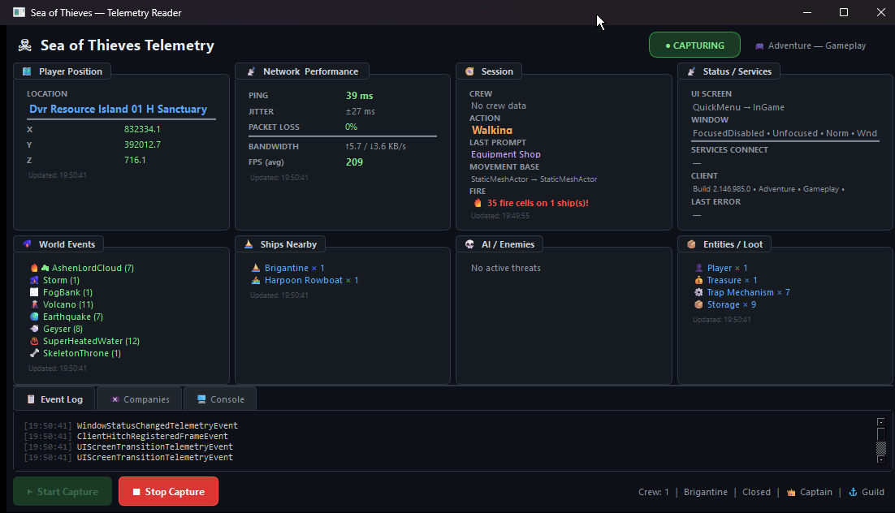

# ☠ Sea of Thieves Telemetry Reader

Real-time Sea of Thieves telemetry dashboard powered by **mitmproxy + PySide6**.

---


## 📸 Screenshot



---

## 🚀 Features

- Real-time telemetry parsing  
- Live player position tracking  
- Ship system monitoring (active controls & equipment)  
- World event detection  
- AI / enemy tracking  
- Network & FPS statistics  
- Company progression overview  
- Action state tracking (60+ different states)
- Last updated timestamps on all sections
- Auto proxy management (Windows)  
- Clean dark-mode dashboard  

---

## 📦 Project Structure

```
SeaOfThievesTelemetry/
│
├── sot_reader.py        # Main GUI application
├── game_capture.py      # mitmproxy telemetry parser
├── README.md
└── Logs (auto-generated)
    ├── sea_of_thieves_capture.txt
    └── websocket_capture.txt
```

---

## ⚙ Requirements

- Python 3.10+
- mitmproxy
- PySide6

Install dependencies:

```bash
pip install mitmproxy PySide6
```

---

## ▶ Running From Source

```bash
python sot_reader.py
```

1. Click **Start Capture**
2. Launch Sea of Thieves
3. Watch the dashboard update in real-time

---

## 🏗 Building a Standalone EXE

```bash
pyinstaller --onefile --windowed --name "SoT_Reader" sot_reader.py
```

**Important:**  
`game_capture.py` must be placed in the same directory as the EXE.

```
SoT_Reader.exe
game_capture.py
```

---

## 🔐 First-Time Certificate Setup

mitmproxy requires installing its certificate:

1. Run:
   ```bash
   mitmproxy
   ```
2. Open:
   ```
   http://mitm.it
   ```
3. Install the Windows certificate
4. Close mitmproxy

Certificate location checked automatically:

```
%USERPROFILE%\.mitmproxy\mitmproxy-ca-cert.cer
```

---

## 🧠 What Gets Captured

### Player
- Position (X/Y/Z)
- Island / region
- Current action state (60+ states tracked)
- Movement base (ground, ship, ladder, etc.)
- Interaction prompts
- Crew information

### Ship
- Ship type (Sloop, Brigantine, Galleon)
- Active control systems:
  - Wheel (steering)
  - Sails
  - Capstan (anchor)
  - Cannons
  - Harpoons
  - Rudder
  - Pulleys
- **Note:** Hull damage, water level, and sinking detection data is unreliable and excluded

### World Events
- Skull Clouds
- Ashen Lords
- Storms
- Volcanoes
- Skeleton Forts
- Shipwrecks

### AI & Entities
- Skeletons
- Phantoms
- Megalodon
- Kraken
- Sirens
- Ocean Crawlers
- Nearby ships
- Loot / actors

### Network & Performance
- Ping (RTT)
- Jitter
- Packet loss
- Bandwidth
- Estimated FPS

---

## 📂 Generated Logs

Automatically created:

```
sea_of_thieves_capture.txt
websocket_capture.txt
```

Includes:

- Full telemetry JSON
- WebSocket payloads
- Binary dumps (if applicable)
- Timestamped events

---

## 🛑 Proxy Handling (Windows)

The application automatically:

- Enables system proxy when capture starts
- Disables proxy on stop
- Disables proxy on crash or forced exit

Manual fallback:

```
Internet Options → LAN Settings → Disable Proxy
```

---

## ⚠ Disclaimer

This project:

- Does NOT modify the game
- Does NOT inject into game memory
- Only observes outbound telemetry traffic
- Intended for educational / research use

Use responsibly.

---

Made for pirates who like data ☠
